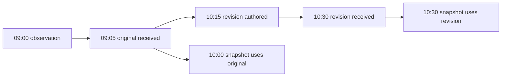

# Reconstructing what was known at a given time

`care_history.py` resolves a **synthetic, append-only observation history** at an arrival-time cutoff. The original row validator remains available in `care_evidence.py`; its existing input contract and benchmark results are unchanged.

```bash
python3 care_history.py fixtures/history.json --as-of 2026-01-01T10:00:00Z
python3 care_history.py fixtures/history.json --as-of 2026-01-01T10:30:00Z --format markdown
python3 benchmarks/history_replay.py --output build/history-replay
```

The last command produces the [replay example](examples/history-v1/REPORT.md), six snapshots, and a deliberately incorrect latest-state comparison. It requires a new output directory and never overwrites an existing run.

## Three instants

| Field | Meaning | Example |
| --- | --- | --- |
| `observed_at` | When the observation occurred. | 09:00 |
| `corrected_at` | When a revision was authored; `null` for an original. | 10:15 |
| `received_at` | When this version became available to the receiving system. | 10:30 |

An authored revision is not available until it is received. Availability is determined by `received_at <= as_of`, inclusive, using UTC instants. Equivalent timestamps with different offsets compare equally.



Every visible row must satisfy `observed_at <= received_at`. A revision must also satisfy `observed_at <= corrected_at <= received_at`, and its authoring time must be at or after receipt of its predecessor. Clock skew is rejected under this first version's strict contract; it is not silently adjusted.

## Input contract

History replay accepts JSON only, with an explicit wrapper:

```json
{
  "history_schema_version": 1,
  "events": []
}
```

Each event carries the ten observation fields described in [SCHEMA.md](SCHEMA.md), plus **required** `received_at` and `corrected_at` fields. `schema_version` remains integer `1`; the history wrapper version is a separate contract. An empty history or a cutoff before any arrival is valid and yields an empty snapshot, not an inferred negative event.

- Original: `corrects: []`, `corrected_at: null`.
- Revision: a **new event_id**, with `corrects` naming exactly one immediate predecessor (a non-empty string or one-element string array).
- Revisions are complete replacement records, not patches. They preserve the original observation instant, though an equivalent timezone offset representation is allowed.
- Each chain resolves to one selected record. The root ID identifies the logical observation; event IDs identify versions.
- Names such as `synthetic-a` in the fixture are generated examples, not pseudonymised real records.

The history resolver validates required fields, basic types, the supported schema version, status consistency, timestamps, and reference integrity. It does not apply speculative-language heuristics, verify IANA timezone names against timestamp offsets, or establish factual correctness. The old single-row checker and browser demo do not perform this history resolution.

## Resolution policy

1. Parse the wrapper and each row's `received_at`.
2. Exclude rows received after the cutoff **before** validating their remaining fields or resolving their references.
3. Validate the visible records and their correction graph.
4. Select the latest visible version along each unambiguous chain; return the full chain as lineage.
5. Sort logical observations by observation instant and root ID. Input file order has no effect.

Reject the snapshot rather than silently choosing a result when visible records contain:

- duplicate event IDs;
- missing or unavailable predecessors;
- multiple direct revisions of the same predecessor (a branch);
- cycles or self-references;
- multiple predecessor references, unsupported versions, invalid timestamps, or impossible time ordering;
- a revision that changes the observation instant.

To revise again, refer to the previous revision, not to the original. Merging branches, correcting observation timestamps, out-of-order predecessor delivery, and references outside the supplied history are not supported. Supply a complete, unambiguous history satisfying this contract.

Only receipt time can decide whether a row is visible. If a row lacks a parseable receipt time, the snapshot fails even if that row was intended to be in the future. Future records with valid receipt times do not affect past selected records or aggregates, even if their later contents are invalid. A separate latest-cutoff validation can reveal later integrity problems.

## Output and auditability

JSON is the default; `--format markdown` provides an English summary. Success returns `0`; input/history errors return `2`, with a message on stderr and no partial report on stdout.

The output contains:

- the UTC cutoff and selected full event versions;
- lineage from original to selected version and superseded IDs;
- visible-version counts and the number excluded after the cutoff;
- counts of observed, not-occurring, and not-recorded logical records.

`excluded_after_cutoff` is full-archive audit metadata, **not a feature available at the historical cutoff**. Do not feed this count into a historical model. Historical features must be derived from selected events available at the cutoff.

The example aggregate is `observed / (observed + not_occurring)`. Unrecorded slots remain unknown and are excluded from the denominator. With no known records the fraction is `null`, not zero. This descriptive synthetic probe is not a risk score or model evaluation.

The resolver does not mutate input or write back to the archive. File hashes in the replay report identify the exact input and code. This utility does not enforce storage immutability, authenticate arrival timestamps, or reconstruct deleted records. Correct historical reconstruction depends on truthful arrival metadata and a preserved append-only history.

## Verification

The tests cover inclusive cutoffs, authored-but-undelivered revisions, delayed observations, chained corrections, future-content invariance, input order, offset equivalence, malformed histories, and long chains.

```bash
python3 -m unittest discover -s tests -p 'test_care_history.py' -v
```
