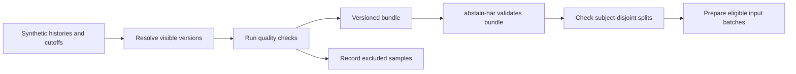

# Synthetic bundle contract for experiment-input preparation

The toolkit exports as-of observation summaries to a separate consumer in [abstain-har](https://github.com/larai-w/abstain-har). This first integration exercises data boundaries and subject separation. It does **not** transform observations into HAR sensor features, train a model, or measure model abstention.



## Export

```bash
python3 care_export.py fixtures/integration-request.json --output build/care-bundle.json
```

Use a new output filename. The fixed synthetic request contains six samples for four generated subject IDs. Each sample declares `sample_id`, `subject_id`, an offset-aware `as_of`, and a complete `history` using [HISTORY.md](HISTORY.md).

The exporter resolves the history first, then checks only selected visible records. A malformed history fails the entire request with exit code 2; it is not disguised as a successful quality rejection. Validation completes before an output file is created. Existing files are never overwritten.

## Shared contract

[contracts/care-bundle-v1.json](contracts/care-bundle-v1.json) is a small versioned registry, **not a JSON Schema document**. The producer and consumer keep byte-identical copies and compare SHA-256 values. Runtime code enforces the field and semantic constraints. The contract identifies:

- `contract_version: 1`, `dataset_kind: synthetic`;
- `feature_set: synthetic_indicator_summary_v1`;
- ordered feature names: `observed_fraction`, `known_count`, `unknown_count`;
- decisions: `eligible`, `quality_rejected`, `insufficient_data`;
- subject split roles: `fit`, `calibration`, `threshold`, `test`.

The three features describe selected logical observations over the supplied history up to the cutoff. `observed_fraction = observed / (observed + not_occurring)`; `known_count` is that denominator, and `unknown_count` counts `not_recorded` records. These are **toy indicator summaries**, not sensor windows, HAR features, targets, or predictions.

Decision precedence:

| Decision | Condition | Feature payload |
| --- | --- | --- |
| `quality_rejected` | At least one quality finding on a selected version. | `null` |
| `insufficient_data` | No quality findings, but no known observations. | `null` |
| `eligible` | No quality findings and at least one known observation. | Exactly the three named values. |

These are input decisions, not model confidence or abstention. A schema-valid but false observation may still pass. The existing heuristic's false alarms remain visible rather than being silently relaxed for this demo.

## Provenance boundary

Each row records selected version IDs, observation/receipt timestamps, statuses, and revision lineage. Raw observation/interpretation text and the count of future records are omitted from the bundle. Full-input and producer-source hashes are audit metadata, not features: a full-history hash can change when later records change even if the as-of feature vector stays identical.

The receiver checks that every selected version was observed and received by its cutoff, lineage covers the selected versions, numerical features match audited status counts, and decisions agree with quality findings. Only the explicit three-feature vector enters an eligible batch. Audit hashes, IDs, and timestamps are not silently appended to that vector.

Hashes establish correspondence, not authenticity. This consumer does not independently re-run the raw-history resolver or authenticate records, subject IDs, or quality findings. A producer that fabricates mutually consistent features and audit metadata cannot be detected by these checks. Subject aliases and errors in the caller's history-to-subject assignment require independent data provenance controls.

## Cross-repository run

Clone both repositories side by side, then run from `abstain-har`:

```bash
python3 scripts/check_care_integration.py --toolkit ../open-care-evidence-toolkit
```

The script uses a temporary directory, verifies matching contracts, runs the toolkit exporter, runs the consumer, and compares the result with its checked-in example. The integration CI in abstain-har pins the producer revision; contract or source changes require intentionally updating the pin and example bundle.

Alternatively, pass the exported bundle directly:

```bash
python3 prepare_inputs.py ../open-care-evidence-toolkit/build/care-bundle.json \
  --splits examples/integration/splits.json --output artifacts/prepared.json
```

The receiver requires every declared subject to appear in exactly one of the four roles. Unassigned, duplicated, overlapping, or unknown subjects are errors. Different samples of the same subject remain in the same role. The synthetic example has one eligible sample per role; this is a contract test, not a sufficient sample size for training or evaluation. An empty eligible role is reported explicitly and no training-readiness claim is made.

## Measured integration result

The [example bundle](examples/integration-v1/bundle.json) contains six rows. The consumer prepares four eligible rows and records two exclusions: one `insufficient_data`, one `quality_rejected`. At the early test cutoff a speculative observation is rejected; at the later cutoff its visible corrected version passes. Future metadata changes cannot alter the earlier features or decision.

A real HAR adapter will require a separate feature contract with sensor units, sampling/window conventions, dataset provenance, and labels. Research recordings must retain their own provenance rather than being labelled synthetic. That adapter and model evaluation are not implemented here.
